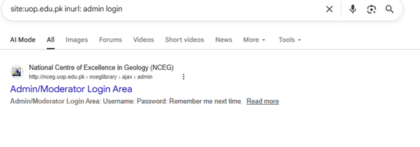

# Public Interface Exposure Analysis via Search Operators

This section analyzes how search engine indexing parameters (Google Dorking) can be utilized to identify public-facing administrative portals or management login screens on a target domain.

##  Advanced Search Parameter Breakdown
  ```

By combining specific search engine commands, results are filtered to isolate authentication endpoints rather than standard public content.

* **Query Syntax:** `site:uop.edu.pk inurl:admin login`

### How the Operator Logic Works:
1. **`site:uop.edu.pk` (Domain Constraint):** Instructs the search engine crawler to restrict its search index entirely to the specified target root domain and any associated subdomains.
2. **`inurl:admin login` (String Filtering):** Directs the search indexer to only return pages where the specific terms `admin` and `login` appear sequentially or together inside the raw URL path string.


## 📊Findings & Impact Analysis

Executing this precise query filters out standard student or faculty front-end pages to expose deep-linked management entry points:

* **Discovered Endpoint:** `http://nceg.uop.edu.pk/nceglibrary/ajax/admin`
* **Exposed Component:** Admin/Moderator Login Area
* **Risk Assessment:** The search engine index successfully scraped and cached the form parameters (specifically capturing input fields like `Username:`, `Password:`, and the `Remember me next time` checkbox). While the page itself is intended for administrative staff, making the URL publicly searchable increases the target visibility for automated brute-force attacks or credential stuffing.

##  Remediation Best Practices

To prevent public search engine crawlers from indexing sensitive management directories or authentication portals, systems administrators should implement the following defenses:

1. **Robots Exclusion Standard (`robots.txt`):** Explicitly instruct search engine bots not to crawl backend or administrative paths by updating the root configuration file:
   ```
   text
   User-agent: *
   Disallow: /ajax/admin/
   Disallow: /nceglibrary/ajax/
   
