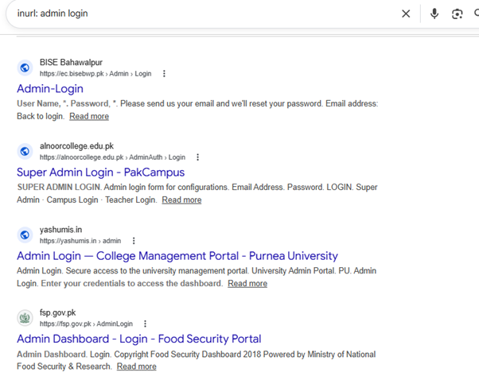

# Identifying Administrative Interfaces Using URL Content Filtering

This section documents the use of targeted search operators (Google Dorking) to scan public search indexes globally for exposed administrative login panels or portal gateways.

##  Search Parameter Breakdown

By targeting patterns commonly found in administrative URL structures, it is possible to locate system entry points that have been crawled by commercial search engine bots.

* **Query Syntax:** `inurl: admin login`

### How the Operator Logic Works:
1. **`inurl:` (URL Inclusions):** This operator instructs the search engine to filter its entire global index and restrict results exclusively to pages where the specified string patterns appear directly inside the web address (URL).
2. **`admin login` (Target Strings):** The engine searches for instances where both `admin` and `login` are present in the URL path (e.g., `/admin/login.php`, `/AdminLogin/`, or `/admin_login`).

---

## Findings & Crawl Analysis

Executing this generic query identifies management portals across various public and institutional infrastructures by matching their directory names:

* **Educational & Government Portals:** The search results demonstrate how public entities (such as `.edu.pk` and `.gov.pk` domains) hosting management platforms or campus networks can have their backend entry points indexed.
* **Metadata Scraped:** The search engine snippets successfully extract structural descriptive text directly from the active forms—including notices like `User Name, *, Password, *, Please send us your email...` or `Admin Dashboard - Login`.
* **Exposure Risk:** While administrative login panels must exist for backend management, allowing public crawlers to index their explicit locations increases exposure to unauthorized credential-guessing attempts, automated brute-force scripts, or credential-stuffing campaigns.

---

##  Remediation & Defensive Configurations

To restrict public search engines from listing sensitive authentication paths, administrators should deploy standard access controls and crawl restrictions:

1. **Configure Web Crawlers (`robots.txt`):** Explicitly instruct search engine bots to ignore directories containing login scripts or backend assets. Place the following rules in the site's root directory:

   ```text
   User-agent: *
   Disallow: /admin/
   Disallow: /login/
   Disallow: /AdminLogin/
   
