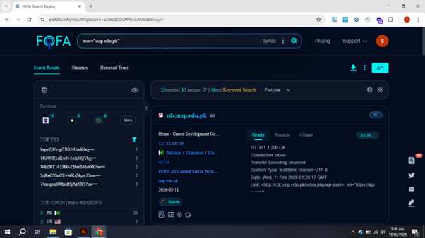

# Internet Asset Mapping & Banner Grabbing via FOFA Engine

This section documents the process of passive reconnaissance using geospatial and asset indexing search engines (specifically FOFA) to map network perimeters, identify server headers, and list exposed subdomains without making direct offensive contact with the target.

## 📊 Perimeter Analysis & Evidence

Below is the verified asset mapping layout extracted from the intelligence engine tracker:



---

## 🔍 Search Parameter Breakdown

* **Query Syntax:** `host="uop.edu.pk"`

### How the Query Logic Works:
* **`host="[domain]"`**: This specialized filter restricts the asset database search results exclusively to hosts, servers, or subdomains bound to the parent domain string (`uop.edu.pk`).

---

## 📋 Findings Analysis

Executing this query maps the public infrastructure footprint of the target domain by aggregating real-time server responses:

### 1. Subdomain & Host Isolation
* **Identified Asset:** `cdc.uop.edu.pk` (Career Development Center)
* **Resolved IP Address:** `121.52.147.19`
* **Geographic/ASN Profile:** Hosted via the Pakistan Education & Research Network (PERN AS), with routing physically located in Islamabad, Pakistan.

### 2. Banner Grabbing & Server Headers
The engine automatically retrieves the raw HTTP response headers during its global internet scanning passes:
* **HTTP Status Code:** `HTTP/1.1 200 OK` (Indicates the endpoint is live and accessible).
* **Technology Stack:** Detected running an **Apache** web server.
* **Content Framework Metadata:** The header exposes an active REST API path link (`/index.php/wp-json/`), indicating the underlying application layer relies on the **WordPress** content management system.

---

## 🛡️ Remediation & Infrastructure Hardening

To manage perimeter visibility and reduce the data footprint available to automated asset harvesters, administrators deploy defensive adjustments:

1. **Server Tokens Obfuscation:** Modify the web server configuration files (e.g., `httpd.conf` for Apache or `nginx.conf`) to minimize header output. This hides explicit software version numbers and operating system information from public banner-grabbing scanners:
   ```text
   # Apache Mitigation
   ServerTokens ProductOnly
   ServerSignature Off
