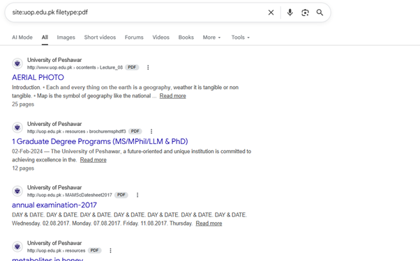

# Open Source Intelligence (OSINT) & Advanced Search Operator Guide

This repository documents passive information gathering methodologies using advanced search engine operators (Google Dorking) to locate public documents and index entries linked to specific educational domains.

## 🔍 Google Dorking Methodology

Google Dorking involves using specialized search syntax to filter through indexed internet results, allowing researchers to uncover specific file types or directory listings without interacting with the host system directly.

### Search Query Analysis
* **Query Executed:** `site:uop.edu.pk filetype:pdf`
* **Target Domain:** `uop.edu.pk` (University of Peshawar)
* **File Type Scope:** `.pdf` (Portable Document Format)

### Public Indexing Discoveries
The advanced search parameters successfully filtered the search engine index to expose public documents hosted on the target servers:

* **Academic Resources:** Indexed lecture files (e.g., `Lecture_08` titled *AERIAL PHOTO*).
* **Institutional Literature:** Official university brochures and academic program listings (e.g., `brochuremsphdff3` outlining Graduate Degree Programs for MS/MPhil/LLM/PhD).
* **Historical Records:** Publicly accessible examination schedules and date sheets from archiving directories (e.g., `MAMScDatesheet2017`).

--> **Disclaimer:** The information documented within this project involves analyzing publicly available indices compiled by commercial search engines. This material is designed strictly for architectural mapping, public exposure compliance verification, and educational research purposes

