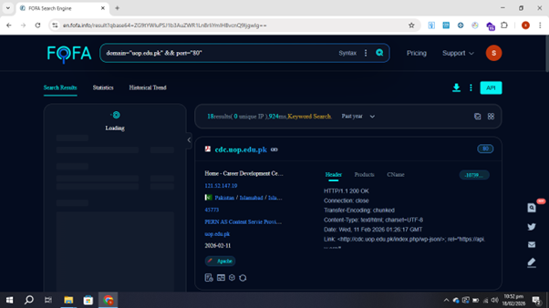

# Public Infrastructure Analysis via FOFA Reconnaissance Engine

This section documents the process of mapping public network perimeters and gathering active asset metadata using the FOFA search engine. This allows analysts to inspect server configurations and infrastructure details passively, without interacting with the target system directly.

## 📊 Perimeter Audit & Live Evidence

The screenshot below displays the active intelligence dashboard, logging the network parameters and banner data captured during global internet mapping passes:



---

## ⚙️ How the FOFA Engine Operates

Unlike traditional consumer search engines that crawl and catalog frontend HTML webpage content for text indexing, network search engines like FOFA passively probe the global IPv4/IPv6 address space. 

They interact with target systems by:
1. **Port Scanning:** Checking millions of public IP addresses to see which ports (like 80, 443, 22, 8080) are open and accepting connections.
2. **Banner Grabbing:** Sending standard connection requests to open ports and recording the raw textual data blocks—called "banners"—returned by the hosting software.
3. **Data Aggregation:** Categorizing these banners by domain associations, SSL certificate records, physical hosting geolocation, and Autonomous System Numbers (ASNs).

### Search Syntax Breakdown
* **Query Executed:** `domain="uop.edu.pk" && port="80"`
* **Logical Operator (`&&`):** Conjoins multiple strict search constraints.
* **Domain Parameter (`domain="..."`):** Restricts the engine's global repository database strictly to web assets matching the specified apex domain or any of its subdomains.
* **Port Parameter (`port="80"`):** Filters the results to show only systems where Port 80—the standard network port for unencrypted HTTP web traffic—is wide open and responsive.

---

## 🔍 Detailed Dashboard Findings

The interface highlights a specific live asset matched by the structured query rules:

### 1. Host and Subdomain Isolation
* **Identified Subdomain:** `cdc.uop.edu.pk` (Career Development Center)
* **Resolved IP Address:** `121.52.147.19`
* **Geographic Placement:** Physically located and routed in Islamabad, Pakistan.
* **Network Provider:** Hosted under the Autonomous System Profile **PERN AS** (Pakistan Education & Research Network).

### 2. Banner and Header Analysis
By analyzing the raw HTTP transmission headers captured under the **Header** tab, several structural data layers are discovered:
* **HTTP Status Code:** `HTTP/1.1 200 OK` — Confirms the web service is active, reachable, and serving content normally.
* **Underlying Web Server Technology:** The platform identifies the server stack as **Apache**.
* **Framework Discovery Metadata:** The header contains an explicit operational pathway: 
  `Link: <http://cdc.uop.edu.pk/index.php/wp-json/>; rel="https://api.w.org/"`
  The presence of the `/wp-json/` parameter exposes that this subdomain is running the **WordPress** Content Management System (CMS) framework and has its REST API endpoint open to the public internet.

---

## 🛡️ Remediation & Defensive Recommendations

Exposing complete system fingerprints makes it easier for automated scrapers or malicious actors to identify software versions and plan targeted exploit vectors. To minimize this public data footprint, implement these defensive controls:

1. **Obfuscate Web Server Banners:** Strip out structural identity details from HTTP headers. Configure your server configuration files to output minimal platform data:
   ```text
   # Apache Mitigation (httpd.conf)
   ServerTokens ProductOnly
   ServerSignature Off
