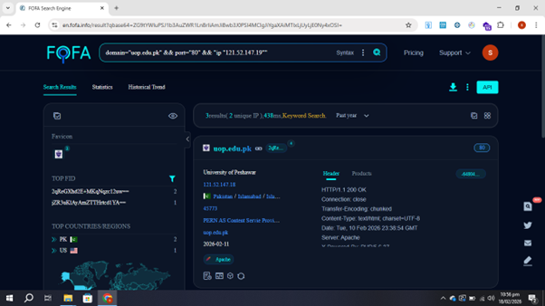

# Advanced Multi-Parameter Asset Filtering via FOFA Engine

This section documents the process of utilizing multi-logical operators within the FOFA asset search engine to map out specific internet-facing nodes, narrowing down infrastructure attributes to targeted IP clusters and ports.

## 📊 Filtered Perimeter Evidence

The screenshot below displays the operational metrics and raw connection banner headers retrieved when compounding network search definitions:



---

## ⚙️ Query Syntax & Multi-Parameter Logic

When auditing complex institutional infrastructures, mixing multiple logical operators prevents dashboard clutter by isolating high-precision targets.

* **Query Executed:** `domain="uop.edu.pk" && port="80" && ip="121.52.147.19"`

### Structural Operator Breakdown:
1. **`domain="uop.edu.pk"` (Scope Isolation):** Restricts the engine's query pool exclusively to subdomains or root assignments mapped to the target educational entity.
2. **`port="80"` (Service Filtering):** Filters down entries to reveal only active servers hosting unencrypted web infrastructure (HTTP).
3. **`ip="121.52.147.19"` (Host Pinpointing):** Instructs the database crawler to pull active data records strictly belonging to this individual host IP address block.
4. **The `&&` Connector (Logical AND):** Forces the search engine to return records only if they meet all three criteria simultaneously, resulting in a highly focused asset set (reducing broad results down to just a few matching hosts).

---

## 🔍 Core Interface Discoveries

Analyzing the live response dashboard reveals key configuration layers regarding the target network node:

### 1. Network Profile & Infrastructure Routing
* **Primary Identity Root:** `uop.edu.pk` (University of Peshawar).
* **Resolved Host Segment:** Map matches specific service networks within the physical routing hub located in Islamabad, Pakistan.
* **Upstream Carrier Allocation:** Operating under **PERN AS** (Pakistan Education & Research Network Content Service Provider).

### 2. HTTP Response Banner Inspection
The raw data scraped under the **Header** tab displays the default application transaction profile for the server cluster:
* **Connection Status:** `HTTP/1.1 200 OK` — The server layer is live, operational, and accepting public connections.
* **Server Software Identification:** The header explicitly discloses the software stack as **Apache**.
* **Software Fingerprint Handling:** Leaving generic headers active allows external platforms to passively track system uptimes, generation cycles, and server structures without triggering any active intrusion alarms.

---

## 🛡️ Remediation & Perimeter Hardening

Exposing clean server definitions via interconnected search strings makes it easy for automated reconnaissance bots to index specific assets. Implement these defenses to limit visibility:

1. **Implement Aggressive Header Scrubbing:** Configure the web server application to strip default application identities from outbound response envelopes. In Apache, modify the runtime variables to limit disclosure:
   ```text
   # Mitigation configuration within httpd.conf
   ServerTokens ProductOnly
   ServerSignature Off
